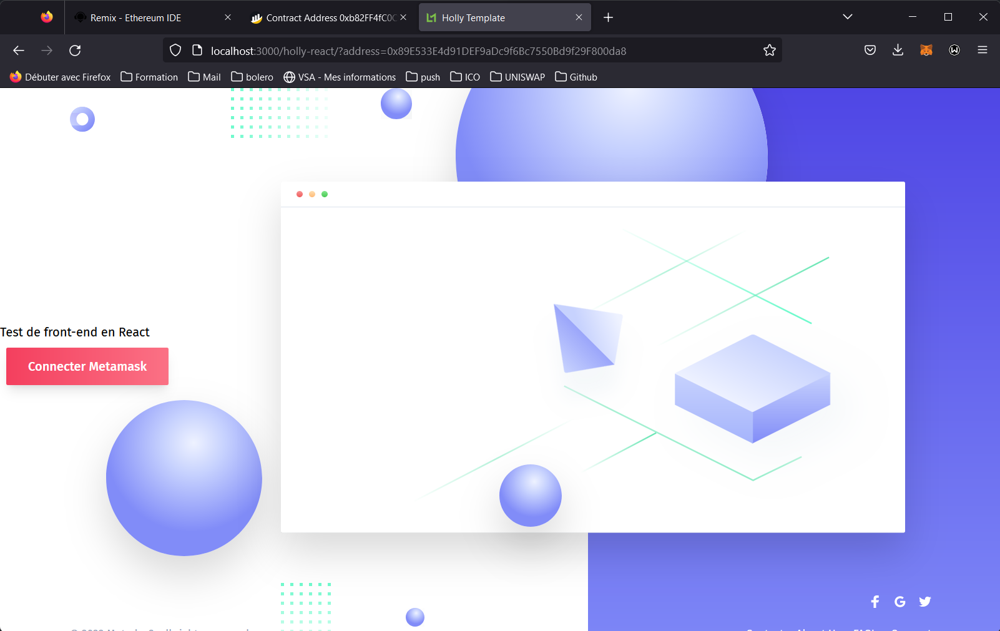

## SOLIDITY PART

You will find my contracts in /contracts folder  

here are their bnb testnet addresses :  
MyToken :  0xb82FF4fC0Cf0aab3C9c386342396C1f50AF8fd7b
Mytoken2 :  0x0fcc3fAA9777A4BeFCd1f9196ef1d86655a38783

pool :  0xb793DD5b57874674718f3470278769d4F784D8Ad

Note: When I test the function 'transfer' directly on remix, it works (the fees are applied), but when I tried to swap on PancakeSwap, the fees are not applied, like if it was the default ERC20 transfer function that was called instead of mine custom.

## REACT PART

I took a react template and tried to interact with my contract (MyToken)  
Here is the current state screenshots :  

  
  
  

# Holly

A React implementation of [Davide Pacilio's](https://cruip.com/) free landing page template, [Holly](https://lukemcdonald.github.io/holly-react/).

# Getting Started

- Run `npm install`
- Run `npm run dev`
